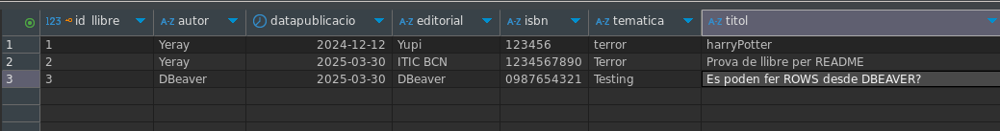

# Documentació i proves M06UF4A02

## Usuaris
### Usuari a la BBDD (MariaDB)

- Usuari: Yeray
- Contrasenya: 1234

### Usuari web:

- Usuari: toni
- Constrasenya: h3ll0!!

## Proves de l'aplicació

### Prova d'inici de sessió
Per iniciar sessió a l'aplicació web, cal accedir a la pàgina d'inici de sessió i introduir les credencials corresponents. En aquest cas, s'han utilitzat les següents:
- Usuari: toni
- Contrasenya: h3ll0!!

Un cop introduïdes les credencials, es fa clic al botó "Accedir". Si les dades són correctes, es redirigeix a l'usuari al index de la web.

Cas credencials correctes:

Cas credencials incorrectes:
En aquest cas, si s'introdueixen credencials incorrectes, com en el exemple, es quedarà en la mateixa pàgina.

### Prova d'inserció de llibres

Un cop s'ha iniciat sessió correctament, es pot accedir a la funcionalitat d'inserció de llibres. Per fer-ho, cal clicar al botó "Insereix un nou llibre" que es troba en la part central de la pàgina.

Una vegada a la pagina omplim els camps, tenint en compte que el nostre ISBN ha de tenir 10 digits:

Si la inserció és correcta ens redigira a la pagina de consulta on podrem veure tots els llibres, entre ells el que acabem d'inserir.

Per acabarho de comprobar ho mirarem a la ostre BBDD:

Com podem veure a la imatge, el llibre que hem inserit a través de l'aplicació web també es troba registrat a la base de dades (MariaDB), confirmant així que la inserció s'ha realitzat correctament.

#### Prova error amb ISBN

Aquesta secció comproba que pasa quan intentem inserir un llibre amb un ISBN que no compleix els requisits establerts (10 dígits). En aquest cas, s'ha introduït un ISBN de 9 dígits.

El que pasarà a continuacio és que no s'afegirà el nostre llibre a la BBDD i pasarà igual que amb el intent fallit de login, en quedarem a la mateixa pagina d'inserció de llibres sense cap canvi.

### Prova consulta de llibres

#### Consulta afegint llibres
La nostre web compta amb un apartat de consulta de libres "/consulta" on la que podem veure tots els llibres que tenim registrats a la nostra base de dades (MariaDB). Per accedir a aquesta funcionalitat, cal clicar al botó "Consulta la llista de llibres" que es troba en la part central de la pàgina.

Aquest seria el seu aspecte:

Per provar que funciona correctament afegirem un nou registre manualment desde la eina DBeaver i comprovarem que surt a la nostra web.

Un cop afegit el llibre manualment a la base de dades, tornem a carregar la pàgina de consulta de llibres a la web per veure si apareix el nou registre.

Com podem observar a la imatge, el llibre que hem afegit manualment a la base de dades (MariaDB) ara apareix en la llista de llibres de la nostra aplicació web, confirmant així que la funcionalitat de consulta està treballant correctament.

#### Consulta sense llibres

Per aquesta seccio borrarem tots els llibres a veure si la nostra web funciona correctament sense cap llibre registrat. Per fer-ho, utilitzarem la eina DBeaver per eliminar tots els registres de la taula "llibres".

Un cop hem eliminat tots els llibres de la base de dades (MariaDB), tornem a carregar la pàgina de consulta de llibres a la web per veure si es maneja correctament el cas en què no hi ha llibres registrats.

Com podem veure a la imatge, quan no hi ha llibres registrats a la base de dades, la nostra aplicació web mostra un missatge indicant que no hi ha llibres disponibles. Això confirma que la funcionalitat de consulta maneja correctament el cas en què no hi ha registres.

### Prov busca per ID

Per fer aquesta prova he inserit dos registres de prova amb les id's 4 i 5 que seran les que buscarem a la pagina de busca per ID.

Per accedir a la funcionalitat de cerca per ID, cal clicar al botó "Cerca un llibre per ID" que es troba en la part central de la pàgina.

Un cop a la pagina de cerca per ID, introduïm la ID que volem buscar (en aquest cas 4) i fem clic al botó "Cerca". Si la ID existeix, es mostrarà la informació del llibre corresponent.

Per acabar la prova buscarem tambe el llibre amb id 5, pero abans de fer aixo li canviarem la ID a la ID 5555 per comprobar que funciona correctament:

Per ultim comprobem que surt si busquem una id que no existeix a la nostre BBDD:

