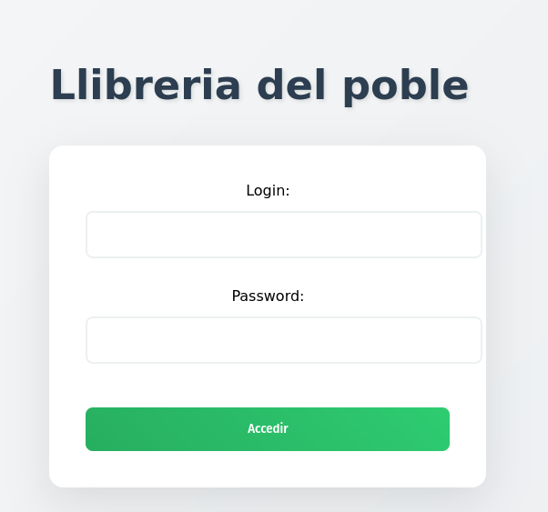

# Documentació i proves M06UF4A02

## Usuaris
### Usuari a la BBDD (MariaDB)

- Usuari: Yeray
- Contrasenya: 1234

### Usuari web:

- Usuari: toni
- Constrasenya: h3ll0!!

## Proves de l'aplicació

### Prova d'inici de sessió
Per iniciar sessió a l'aplicació web, cal accedir a la pàgina d'inici de sessió i introduir les credencials corresponents. En aquest cas, s'han utilitzat les següents:
- Usuari: toni
- Contrasenya: h3ll0!!

Un cop introduïdes les credencials, es fa clic al botó "Accedir". Si les dades són correctes, es redirigeix a l'usuari al index de la web.

Cas credencials correctes:

Cas credencials incorrectes:
En aquest cas, si s'introdueixen credencials incorrectes, com en el exemple, es quedarà en la mateixa pàgina.

### Prova d'inserció de llibres

Un cop s'ha iniciat sessió correctament, es pot accedir a la funcionalitat d'inserció de llibres. Per fer-ho, cal clicar al botó "Insereix un nou llibre" que es troba en la part central de la pàgina.

Una vegada a la pagina omplim els camps, tenint en compte que el nostre ISBN ha de tenir 10 digits:

Si la inserció és correcta ens redigira a la pagina de consulta on podrem veure tots els llibres, entre ells el que acabem d'inserir.

Per acabarho de comprobar ho mirarem a la ostre BBDD:

Com podem veure a la imatge, el llibre que hem inserit a través de l'aplicació web també es troba registrat a la base de dades (MariaDB), confirmant així que la inserció s'ha realitzat correctament.

#### Prova error amb ISBN

Aquesta secció comproba que pasa quan intentem inserir un llibre amb un ISBN que no compleix els requisits establerts (10 dígits). En aquest cas, s'ha introduït un ISBN de 9 dígits.

El que pasarà a continuacio és que no s'afegirà el nostre llibre a la BBDD i pasarà igual que amb el intent fallit de login, en quedarem a la mateixa pagina d'inserció de llibres sense cap canvi.

